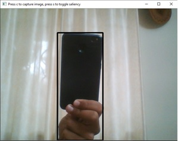
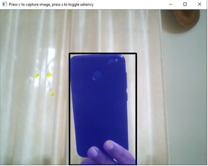

# BOXER_auto_annotation_tool
Real time automatic creation of bounding boxes as well as salience maps around detected objects for fixed backgrounds.

No model training required as it only uses difference in feature maps between the image of the object and the image of the background, hence it can run in real-time.

# Google Colab Link for tutoriak
[Link](https://colab.research.google.com/github/shreyas-bk/BOXER_auto_annotation_tool/blob/master/BOXER_Make_Bounding_Boxes_Around_Objects.ipynb)

# Examples
Bounding box creation around detected object:

Bounding box creation around detected object with salience map highlighted:

Requirements:
- cv2
- tensorflow

Notes:
- Salience maps are optional (can be toggled)
- Images with bounding box around the object as well as a text file for the annotation can be saved
- Salience maps works best with light colored, stable backgrounds

